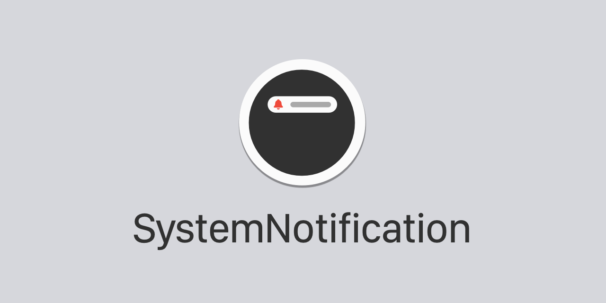

# SystemNotification

<p align="center">
    <br />
    
    
    
    
    <a href="https://twitter.com/danielsaidi">
        
    </a>
</p>


## About SystemNotification

`SystemNotification` is lets you mimic the native iOS system notification (that is presented when e.g. toggling silent mode on and off) in your `SwiftUI` apps.

The result can look like this...or completely different:

<p align="center">
    
</p>

These notifications have a default style, but can be customized to fit your specific app.


## Installation

### Swift Package Manager

```
https://github.com/danielsaidi/SystemNotification.git
```

### CocoaPods

```
pod SystemNotification
```


## Getting started

`SystemNotification` contains a `SystemNotification` view, that can be created with an `isActive` binding, an optional `configuration` and a custom `view`.

For instance:

```swift
let notification = SystemNotification(
    isActive: $isNotificationActive,
    configuration: SystemNotification.Configuration(edge: .bottom)) { _ in
        SystemNotificationMessage(
            icon: Image(systemName: "exclamationmark.triangle"), 
            title: "Alert", 
            text: "Something happened!",
            configuration: SystemNotificationMessage.Configuration(
                iconColor: .red
            )
        )
    }
```

You can use any view you like in the notification, but if you want to use the standard `SystemNotificationMessage`, you can just use this shorthand:

```swift
let notification = SystemNotification(
    icon: Image?,
    title: String,
    text: String,
    isActive: $isNotificationActive,
    configuration: SystemNotification.Configuration(edge: .bottom)) { isActive in
        SystemNotificationMessage(
            icon: Image(systemName: "exclamationmark.triangle"), 
            title: "Alert", 
            text: "Something happened!",
            configuration: SystemNotificationMessage.Configuration(
                iconColor: .red
            )
        )
    }
```

Once you have a notification, you can add it to any view, using the `systemNotification` modifier: 

```swift
List(items) { item
   HStack { item.name }
}.systemNotification(notification)
```

The notification will be added above the view and docked outside of to the selected edge. When the `isActive` binding is set to true, it will slide in using the selected animation.

You can also use a `SystemNotificationContext` to easily present multiple notifications with a single `systemNotification` modifier:

```swift
let context = SystemNotificationContext()
context.present(notification1)
context.present(notification2)

// To use it, provide it instead of an `isActive` binding:
List(items) { item
   HStack { item.name }
}.systemNotification(context: context)
```


## SystemNotification.Configuration

A `SystemNotification` can be configured with a `SystemNotification.Configuration` that specifies:

* `animation`
* `backgroundColor`
* `cornerRadius`
* `edge`
* `minWidth`
* `duration`
* `shadowRadius`

You can customize these properties to control how the notification looks and behaves. 

The default configuration makes the notification look and behave like the native one.


## SystemNotificationMessage.Configuration

A `SystemNotificationMessage` view can be configured with a `SystemNotificationMessage.Configuration` instance that specifies:

* `iconColor`
* `iconFont`
* `padding`
* `textColor`
* `textFont`
* `titleColor`
* `titleFont`

You can customize these properties to control how the notification message looks. 

The default configuration makes the message look like the native one.


## Demo app

This repo contains a basic demo app that demonstrates how to use the bottom sheet.

Just open the `Demo` project and run the app.


## Contact me

Feel free to reach out if you have questions or if you want to contribute in any way:

* E-mail: [daniel.saidi@gmail.com][Email]
* Twitter: [@danielsaidi][Twitter]
* Web site: [danielsaidi.com][Website]


## License

SystemNotification is available under the MIT license. See LICENSE file for more info.


[Email]: mailto:daniel.saidi@gmail.com
[Twitter]: http://www.twitter.com/danielsaidi
[Website]: http://www.danielsaidi.com
