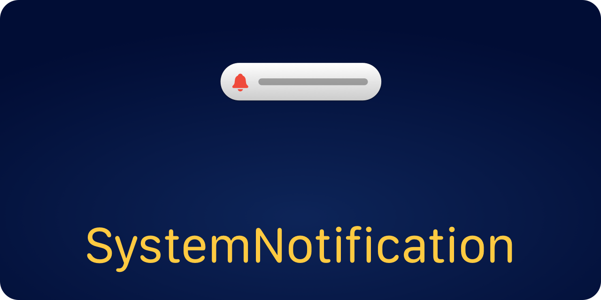
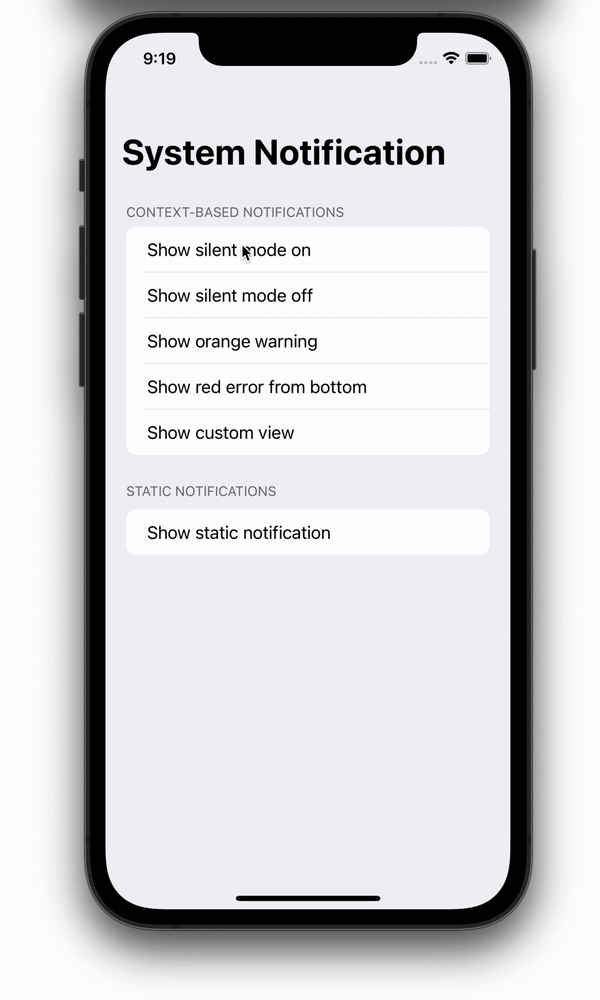

<p align="center">
    
</p>

<p align="center">
    
    
    
    
    <a href="https://twitter.com/danielsaidi"></a>
    <a href="https://mastodon.social/@danielsaidi"></a>
</p>


## About SystemNotification

SystemNotification is a SwiftUI SDK that lets you mimic the native iOS system notification that are presented when you toggle silent mode, connect your AirPods, etc. 

The result can look like this, or completely different:

<p align="center">
    
</p>

System notifications can be styled and customized. You can use a native-looking `SystemNotificationMessage` view as the content view, or any custom view.


## Installation

SystemNotification can be installed with the Swift Package Manager:

```
https://github.com/danielsaidi/SystemNotification.git
```


## Getting started

With SystemNotification, you can add a system notification to any view just as you add a `sheet`, `alert` and `fullScreenModal`, by applying a `systemNotification` view modifier (preferably to the application root view).

State-based notifications take a boolean state binding and a view builder:

```swift
import SystemNotification

struct MyView: View {

    @State
    var isActive = false

    var body: some View {
        VStack {
            Button("Show notification") {
                isActive = true
            }
        }
        .systemNotification(isActive: $isActive) {
            Text("You can use any custom content view")
                .padding()
        }
    }
}
```

Context-based notifications just take a `SystemNotificationContext` instance and can then show many different notifications with a single modifier:

```swift
import SystemNotification

struct MyView: View {

    @StateObject
    var notification = SystemNotificationContext()

    var body: some View {
        VStack {
            Button("Show text") {
                notification.present {
                    Text("Context-based notifications are more flexible.")
                        .padding()
                        .multilineTextAlignment(.center)
                }
            }
            Button("Show message") {
                notification.present {
                    SystemNotificationMessage(
                        icon: Text("👍"),
                        title: "Great job!",
                        text: "You presented a native-looking message!"
                    )
                }
            }
        }
        .systemNotification(notification)
    }
}
```

The `SystemNotificationMessage` view lets you easily mimic a native notification view, with an icon, title and text, but you can use any custom view as the notification body.

For more information about how to configure and style your notifications, predefined message types and styles, and how to create your own custom message types, please see the [getting started guide][Getting-Started].


## Documentation

The [online documentation][Documentation] has more information, articles, code examples, etc.


## Demo Application

The demo app lets you explore the library. To try it out, just open and run the `Demo` project.


## Support my work 

You can [sponsor me][Sponsors] on GitHub Sponsors or [reach out][Email] for paid support, to help support my [open-source projects][OpenSource].

Your support makes it possible for me to put more work into these projects and make them the best they can be.


## Contact

Feel free to reach out if you have questions or if you want to contribute in any way:

* Website: [danielsaidi.com][Website]
* Mastodon: [@danielsaidi@mastodon.social][Mastodon]
* Twitter: [@danielsaidi][Twitter]
* E-mail: [daniel.saidi@gmail.com][Email]


## License

SystemNotification is available under the MIT license. See the [LICENSE][License] file for more info.


[Email]: mailto:daniel.saidi@gmail.com
[Website]: https://www.danielsaidi.com
[GitHub]: https://www.github.com/danielsaidi
[Twitter]: https://www.twitter.com/danielsaidi
[Mastodon]: https://mastodon.social/@danielsaidi
[Sponsors]: https://github.com/sponsors/danielsaidi
[OpenSource]: https://www.danielsaidi.com/opensource

[Documentation]: https://danielsaidi.github.io/SystemNotification/documentation/systemnotification/
[Getting-Started]: https://danielsaidi.github.io/SystemNotification/documentation/systemnotification/getting-started
[License]: https://github.com/danielsaidi/SystemNotification/blob/master/LICENSE
