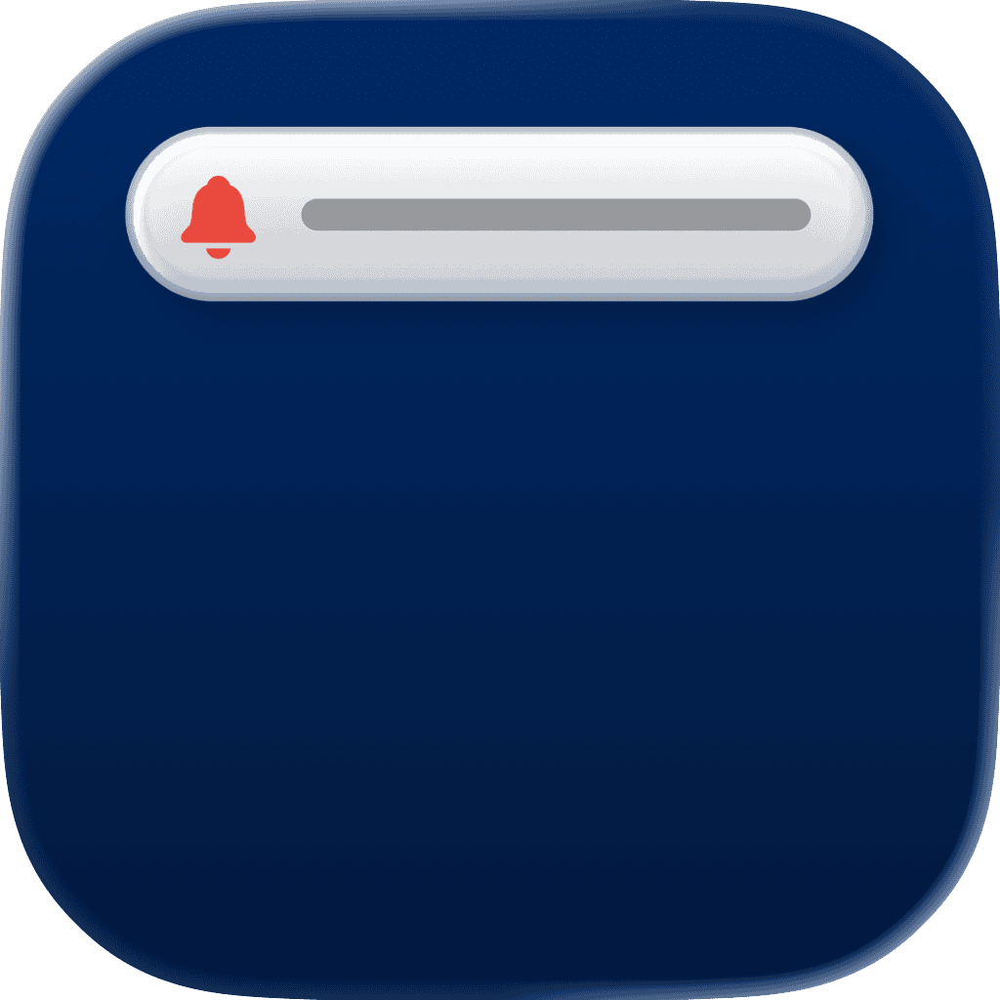

<p align="center">
    
</p>

<p align="center">
    
    
    <a href="https://danielsaidi.github.io/SystemNotification"></a>
    <a href="https://github.com/danielsaidi/SystemNotification/blob/master/LICENSE"></a>
</p>


# SystemNotification

SystemNotification is a SwiftUI library that lets you mimic the native iOS system notification that is presented when you toggle silent mode, connect your AirPods, etc. 

<p align="center">
    
</p>

System notifications can be styled and customized. You can use a native-looking `SystemNotificationMessage` view as the content view, or any custom view.


## Installation

SystemNotification can be installed with the Swift Package Manager:

```
https://github.com/danielsaidi/SystemNotification.git
```


## Getting started

With SystemNotification, you can add a system notification to any view just as you add a `sheet`, `alert` and `fullScreenModal`, by applying a `systemNotification` view modifier (preferably to the application root view).

State-based notifications take a boolean state binding and a view builder:

```swift
import SystemNotification

struct MyView: View {

    @State
    var isActive = false

    var body: some View {
        VStack {
            Button("Show notification") {
                isActive = true
            }
        }
        .systemNotification(isActive: $isActive) {
            Text("You can use any custom content view")
                .padding()
        }
    }
}
```

Context-based notifications just take a `SystemNotificationContext` instance and can then show many different notifications with a single modifier:

```swift
import SystemNotification

struct MyView: View {

    @StateObject
    var notification = SystemNotificationContext()

    var body: some View {
        VStack {
            Button("Show text") {
                notification.present {
                    Text("Context-based notifications are more flexible.")
                        .padding()
                        .multilineTextAlignment(.center)
                }
            }
            Button("Show message") {
                notification.present {
                    SystemNotificationMessage(
                        icon: Text("👍"),
                        title: "Great job!",
                        text: "You presented a native-looking message!"
                    )
                }
            }
        }
        .systemNotification(notification)
    }
}
```

The `SystemNotificationMessage` view lets you easily mimic a native notification view, with an icon, title and text, but you can use any custom view as the notification body.

See the online [getting started guide][Getting-Started] for more information.


## Documentation

The online [documentation][Documentation] has more information, articles, code examples, etc.


## Demo Application

The `Demo` folder has an app that lets you explore the library.


## Support My Work

You can [become a sponsor][Sponsors] to help me dedicate more time on my various [open-source tools][OpenSource]. Every contribution, no matter the size, makes a real difference in keeping these tools free and actively developed.


## Contact

Feel free to reach out if you have questions, or want to contribute in any way:

* Website: [danielsaidi.com][Website]
* E-mail: [daniel.saidi@gmail.com][Email]
* Bluesky: [@danielsaidi@bsky.social][Bluesky]
* Mastodon: [@danielsaidi@mastodon.social][Mastodon]


## License

SystemNotification is available under the MIT license. See the [LICENSE][License] file for more info.


[Email]: mailto:daniel.saidi@gmail.com
[Website]: https://danielsaidi.com
[GitHub]: https://github.com/danielsaidi
[OpenSource]: https://danielsaidi.com/opensource
[Sponsors]: https://github.com/sponsors/danielsaidi

[Bluesky]: https://bsky.app/profile/danielsaidi.bsky.social
[Mastodon]: https://mastodon.social/@danielsaidi
[Twitter]: https://twitter.com/danielsaidi

[Documentation]: https://danielsaidi.github.io/SystemNotification
[Getting-Started]: https://danielsaidi.github.io/SystemNotification/documentation/systemnotification/getting-started
[License]: https://github.com/danielsaidi/SystemNotification/blob/master/LICENSE
