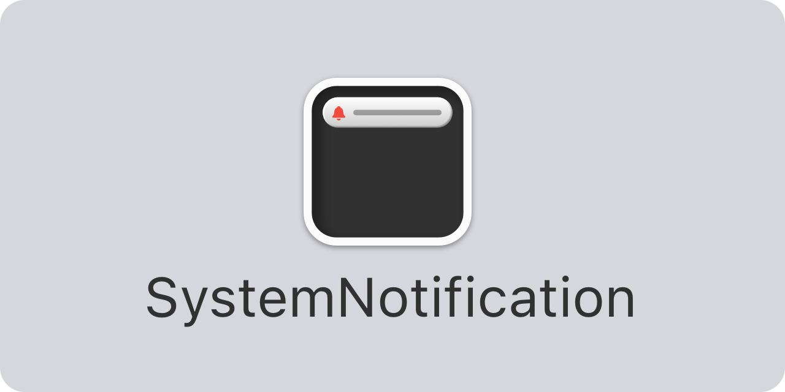

<p align="center">
    
</p>

<p align="center">
    
    
    
    <a href="https://twitter.com/danielsaidi"></a>
    <a href="https://mastodon.social/@danielsaidi"></a>
</p>


## About SystemNotification

SystemNotification is a Swift SDK that helps you mimic the native iOS system notification in SwiftUI. 

The result can look like this, or completely different:

<p align="center">
    
</p>

This system notification can be styled and customized to great extent. You can also use completely custom views.


## Installation

SystemNotification can be installed with the Swift Package Manager:

```
https://github.com/danielsaidi/SystemNotification.git
```


## Getting started

After adding SystemNotification to your project, you can add a system notification to a view hierarchy just as you add `sheet`, `alert` and `fullScreenModal`:

```swift
import SystemNotification

struct MyView: View {

    var body: some View {
        Text("Hello, world")
            .systemNotification(...)
    }
}
```

You can use both state- and context and message-based notifications and style your notifications to great extent.

For more information, please see the [getting started guide][Getting-Started].


## Documentation

The [online documentation][Documentation] has more information, articles, code examples, etc.


## Demo Application

The demo app lets you explore the library on iOS and macOS. To try it out, just open and run the `Demo` project.


## Support my work 

You can [sponsor me][Sponsors] on GitHub Sponsors or [reach out][Email] for paid support, to help support my [open-source projects][OpenSource].

Your support makes it possible for me to put more work into these projects and make them the best they can be.


## Contact

Feel free to reach out if you have questions or if you want to contribute in any way:

* Website: [danielsaidi.com][Website]
* Mastodon: [@danielsaidi@mastodon.social][Mastodon]
* Twitter: [@danielsaidi][Twitter]
* E-mail: [daniel.saidi@gmail.com][Email]


## License

SystemNotification is available under the MIT license. See the [LICENSE][License] file for more info.


[Email]: mailto:daniel.saidi@gmail.com
[Website]: https://www.danielsaidi.com
[GitHub]: https://www.github.com/danielsaidi
[Twitter]: https://www.twitter.com/danielsaidi
[Mastodon]: https://mastodon.social/@danielsaidi
[Sponsors]: https://github.com/sponsors/danielsaidi
[OpenSource]: https://www.danielsaidi.com/opensource

[Documentation]: https://danielsaidi.github.io/SystemNotification/documentation/systemnotification/
[Getting-Started]: https://danielsaidi.github.io/SystemNotification/documentation/systemnotification/getting-started
[License]: https://github.com/danielsaidi/SystemNotification/blob/master/LICENSE
